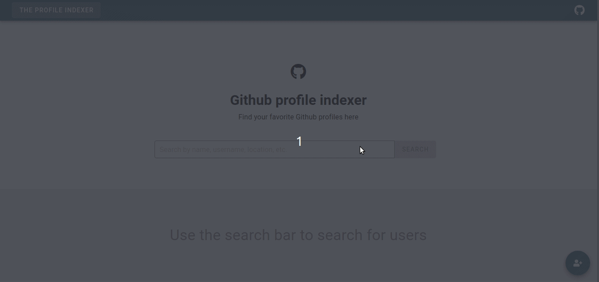
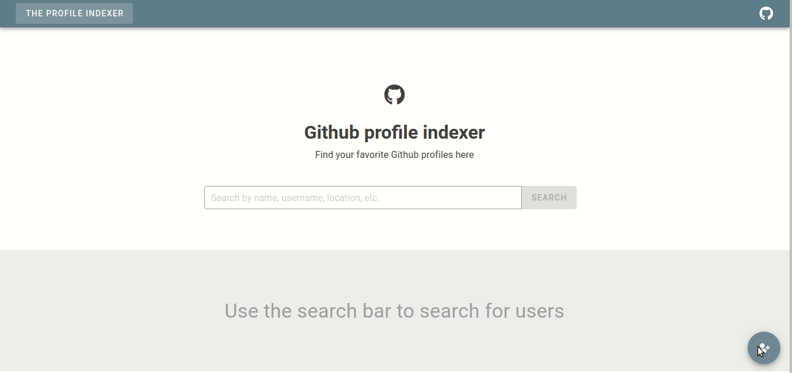
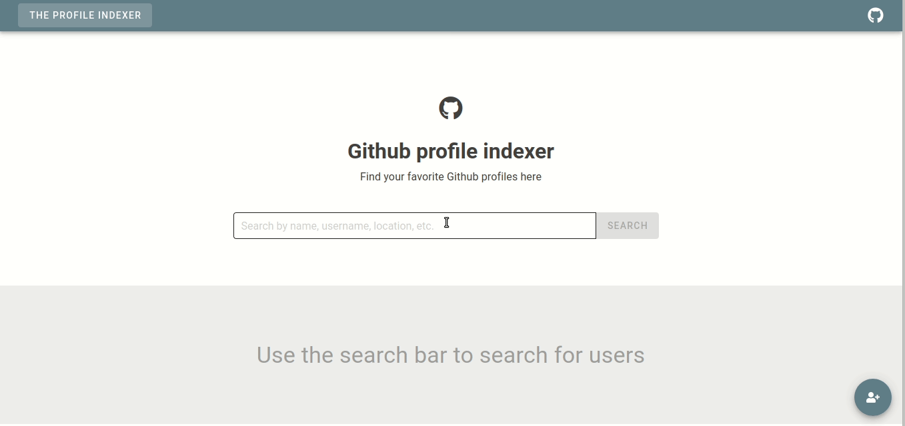
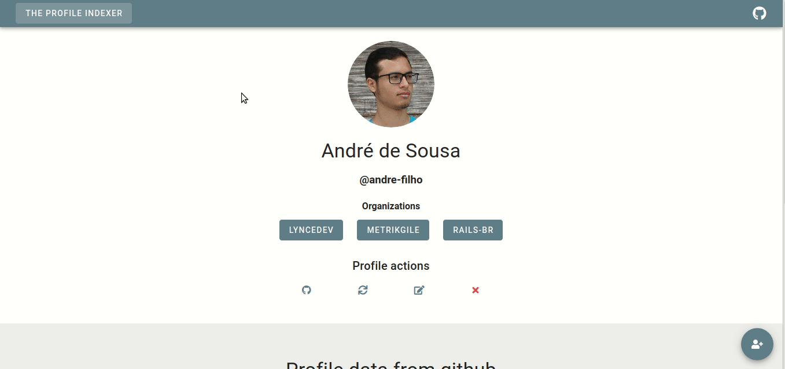
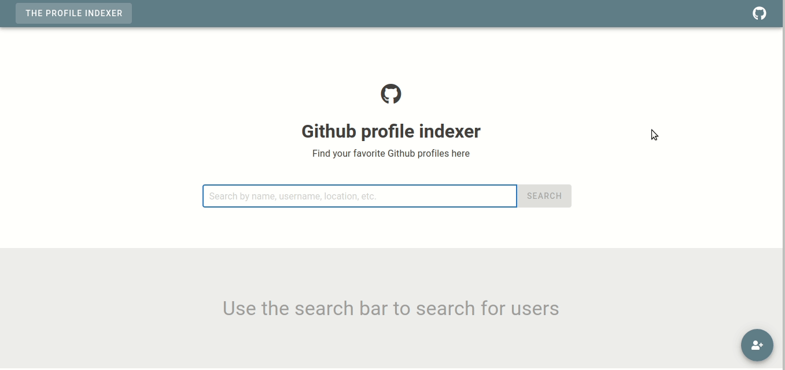
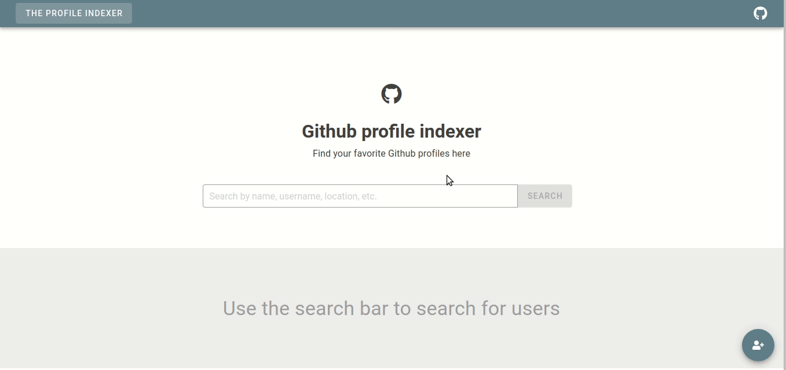

<div style="text-align: center;">
  <h1>
    Github profile indexer
  </h1>
</div>


## Instalação
Para a execução deste projeto é necessário o [Docker](https://docs.docker.com/engine/install/), juntamente com o [docker-compose](https://docs.docker.com/compose/install/). Para subir o ambiente de desenvolvimento com estas ferramentas basta rodar:

```bash
  $ docker-compose up
  # ou caso queira subir com os logs separados, abra dois terminais e execute:
  $ docker-compose up api
  $ docker-compose up front
```

Após o ambiente ter subido, a API se encontra acessável em na porta [localhost:3000](http://localhost:3000) e o front-end na porta [localhost:8080](https://localhost:8080).

## Requisitos e implementação

### Requisitos
| ID | Nome | Descrição |
| -- | ---- | --------- |
| 1 | Cadastro de perfis | Deve-se haver uma página para cadastrar um nome e o endereço da página de perfil do Github desse novo membro. |
| 2 | Webscrapper | Quando o cadastro de um novo membro for realizado, então através de um webscrapper deve-se recuperar e armazenar da página do Github as informações:<ul><li>Nome de usuário do Github</li><li>Número de Followers</li><li>Número de Following</li><li>Número de Stars</li><li>Número de contribuições no último ano</li><li>URL da imagem de perfil</li><li>Email</li><li>Localização</li></ul> |
| 3 | Encurtamento de URLs | Ao cadastrar um perfil, a URL do Github deverá ser armazenada de forma encurtada, por exemplo, https://bitly.com/. |
| 4 | Atualizar perfil por re-scan | Após cadastrado, também deve ser possível escanear (de forma manual) o perfil do Github em busca de novas informações que possam ter sido adicionadas. |
| 5 | Interface do usuário | <ul><li>A página principal do sistema deverá exibir um campo de busca.</li><li>A busca poderá ser preenchida com qualquer informação do perfil (nome, usuário do Github, organização, localização, etc).</li><li>Os resultados deverão ser uma lista de usuários contendo nome, URL encurtada do perfil do Github e botões para editar/visualizar o registro.</li><li>A página de perfil deverá exibir todos os campos salvos.</li><li>Deve-se exibir a imagem de perfil do usuário utilizando a URL salva do Github.</li><li>Deve-se adicionar botões para re-escanear/editar/remover o registro. OBS: deve-se apenas editar o nome e URL, já que os outros dados serão extraídos com Webscrapper.</li></ul> |

### Implementação da solução

#### Perfil de usuário
O perfil de usuário abrange os requisitos 1, 2 e 3. De forma breve, a modelo `Profile` recebe como argumentos o nome e a URL do Github e, durante o ciclo `before_validation`, executa o webcrapping do perfil, coletando as outras informações além de validar a URL e se a página é ou não um perfil de usuário no Github. Neste ponto também são encurtadas as URLs de perfil e de imagem de perfil. Após a validação dos dados coletados, o objeto então é processado.

O encurtamento de URLs é feito a partir do serviço `tinyurl` a partir da gem `shorturl`, enquanto a busca é feita com o auxílio de funcionalidades de pesquisa de texto presentes no postgres com a gem `pg_search`.

#### Atualização de perfil por re-escaneamento
<!-- Por mais que seja possível iniciar a atualização do perfil por meio do update, foi implementado um endpoint para isso -->
Por meio do endpoint de `update` do profile é possível executar esta funcionalidade, a diferença é que devem ser passados os valores de nome e URL já presentes no perfil.

#### Busca e interface de usuário
Como dito anteriormente, a busca ocorre com a ajuda da gem `pg_search`, com ela é definido um escopo de busca que abrange os campos de nome, nome de usuário, localização e organizações. A busca é feita pelo prefixo de qualquer palavra presentes nestes campos.

Os resultados da pesquisa são exibidos em lista, abaixo da barra de busca, em cada entrada têm-se  o nome de usuário, a imagem de usuário, o username e a url do perfil encurtada além das ações de editar, vizualizar e deletar aquele perfil. Essas opções, assim como todas as informações coletadas estão tambem presentes na página de visualização do perfil.

Em todas as páginas é exibido um botão de adicionar novo perfil, e tanto ele quanto os botões de edição e deleção, exibem uma modal com formulários ou confirmações.

## Justificativas

### PostgreSQL
Decidi utilizar o postgres por ele ser meu sgbd de escolha sempre que vou iniciar um projeto com RoR ou Django. Ele é extremamente optimizado, a ponto de conhecer profissionais e pesquisadores que preferem utilizá-lo para tratar de bancos escaláveis do que tecnologias NoSQL como o MongoDB. Outra vantagem tambem é a presença de gems como a `pg_search`.

### Procura com [pg_search](https://github.com/Casecommons/pg_search)
Esta gem permite que se use a funcionalidade de busca de texto do próprio postgres. Decidi utilizá-la por conta da vantagem criada pela optimização dentro do postgres para a pesquisa.

### Vue.js
Para o front-end escolhi utilizar o Vue.js devido à minha já existente experiência
com a tecnologia. E por possuir extensões e bibliotecas de componentes mais fáceis de configurar, no caso estou usando o Vuetify como biblioteca de componentes.

### Docker
A maior vantagem que eu busquei ao utilizar o docker é ter um ambiente mais isolado para o desenvolvimento. Outro ponto é que com o docker-compose basta um comando para subir todo o stack.

## Limitações da solução

- A pesquisa tem como limitação encontrar resultados semelhantes à partir do prefix dos campos `:name, :username, :location` e de cada uma das entradas do `:organizations`. Existe a possibilidade de adicionar a pesquisa por meio de um algoritmo de busca baseado em trigramas, utilizando uma extensão nativa do postgres.

- O campo de e-mail de um usuário no github só aparece quando se está logado, assim como é possível se observar na API do GH. A listagem de organizações também é reduzida quando se acessa sem o login. O valor do email não é resgatado pelo webscrapping.

## Observações e pontos de melhoria
### Back-end
- Inicialmente fiz o sistema de encurtamento de URL por meio de webscrapping, porém notei que as URLs encurtadas estavam sendo desativadas depois de aproximadamente 3h de criação. Em outro momento, a URL passou a direcionar para uma página aleatória do Facebook. Então decidi mudar a implementação desta funcionalidade para suprimir esses erros. Optei por implementar essa funcionalidade a partir da gem `shorturl` utilizando o serviço `tinyurl`.

- Na model de profile decidi manter o encurtamento de URLs assim como a execução do webscrapping dentro da chamada `before_validates`. Assim, aproveitando para fazer a validação das URLs encurtadas juntamente com alguns dos campos coletados do Github.

- Na model de profile pensei em utilizar outras formas de tratar o problema de perfil não encontrado no github. Pesquisando qual ficaria melhor, fui convencido que a melhor forma de tratar isso seria usando o `errors` da propria ActiveRecord.

- Os testes de webscrapping devem ser melhorados, tanto em desempenho quanto em escrita.

- Não estava nas especificações, porém tomei a liberdade de encurtar as URLs de imagem também. O encurtamento de URLs serve principalmente para diminuir o tamanho das entradas na tabela do banco de dados, e pensei que diminuir somente o menor link (da página de perfil é bem menor que o da imagem), não fazia muito sentido. Logo também encurtei a URL das imagens.

### Front-end
- Para o tratamento de perfis não existentes assim como outras rotas não existentes, fiz com que fosse forçado um redirecionamento à página de início da aplicação. Exibindo um card alert com mensagem.

- Considerando que antes de recuperar a imagem do usuário o request será redirecionado, decidi tratar uma possível demora de renderização da imagem de perfil do usuário com uma imagem placeholder, utilizando ferramentas já existentes no componente `v-img` do Vuetify.

- Uma melhoria no front-end também seriam os testes, que cobrem apenas o essêncial das funções dos componentes.

- Outra melhoria do front-end seria a apresentação. Por conta do tempo, mantive a exibição de forma bastante básica.

- Outra funcionalidade que planejei em fazer mas acabei não implementando seria de restringir as ações para usuários deslogados (login seria na aplicação, sem relação com os perfis do github).

- O layout do front-end exibido em dispositivos menores pode ser melhorado. As mensagens de erro são exibidas, porém os formulários no front-end não têm validação própria, que é um ponto de melhoria.

## Capturas de tela


<br/>

#### Deletar perfil

<br/>

#### Procurar perfil

<br/>

<br/>

<br/>

